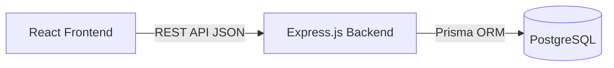

# Architecture Document

## Current Architecture
- **Frontend**: React 19, TypeScript, Vite, TailwindCSS, Framer Motion.
- **State**: Strictly client-side UI state. No data fetching setup.
- **Data**: Static mock data in `src/data/index.ts`.
- **Backend**: *None exists yet.*

## Target Architecture (Planned)
- **Frontend Integration**: Standard `fetch` calls encapsulating API requests.
- **Backend Framework**: **Express.js** running on **Node.js** with TypeScript (See ADR-001).
- **Database**: PostgreSQL database.
- **ORM**: Prisma.
- **Validation**: Zod for end-to-end type safety and runtime validation.

## Frontend/Backend Boundary

## Unresolved Architecture Decisions
- Infrastructure Provider: Exact deployment target (Render vs AWS vs Vercel Serverless) needs human confirmation, though Express strongly implies a long-running server (VPS or container) rather than serverless functions.
