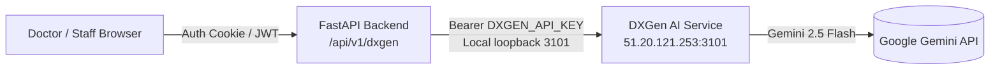

# DXGen AI Integration & Content Generation API Documentation

## 1. Executive Summary & Architecture

The **DXGen AI Content Generation System** provides automated, SEO-optimized, clinically-aligned content generation for the **Kush Dental Clinic** platform. 

The architecture implements a secure **Backend-as-a-Proxy** pattern:
- **Client (Frontend)**: React 19 application inside the Doctor/Staff portal initiates AI generation requests.
- **Kush Dental Backend (FastAPI)**: Enforces authentication, strict Role-Based Access Control (**DOCTOR role only**), validates payloads, applies sanitization, and injects the secure secret API token.
- **DXGen Engine (`port 3101`)**: High-performance AI service connecting to Google Gemini AI models for dental article drafting, SEO metadata generation, FAQs, and social media copywriting.



> [!IMPORTANT]
> **Zero Client-Side Secret Exposure**: `DXGEN_API_KEY` is strictly confined to the backend environment variables (`.env`). Client browsers never communicate with the DXGen service directly.

---

## 2. Backend API Reference (`python_backend/app/api/v1/dxgen.py`)

All endpoints are hosted under `/api/v1/dxgen` and require `Role.DOCTOR` privileges.

### A. Core Endpoints Summary

| Method | Endpoint | Description | Auth / Role |
| :--- | :--- | :--- | :--- |
| `POST` | `/api/v1/dxgen/generate` | Universal content generator for custom formats | `DOCTOR` |
| `POST` | `/api/v1/dxgen/generate/blog` | Generates long-form SEO dental blog articles | `DOCTOR` |
| `POST` | `/api/v1/dxgen/generate/social` | Generates social posts (Instagram, LinkedIn, X, FB) | `DOCTOR` |
| `POST` | `/api/v1/dxgen/generate/business` | Generates Google Business Profile announcements | `DOCTOR` |
| `GET` | `/api/v1/dxgen/content/{content_id}` | Retrieves previously generated content by ID | `DOCTOR` |
| `GET` | `/api/v1/dxgen/usage` | Queries remaining quota and token consumption | `DOCTOR` |
| `GET` | `/api/v1/dxgen/health` | Service health status and AI model probe | `DOCTOR` |

---

### B. Endpoint Details

#### 1. Generate Blog Article
* **Endpoint**: `POST /api/v1/dxgen/generate/blog`
* **Access**: `Role.DOCTOR`
* **Request Payload**:
```json
{
  "topic": "The Ultimate Guide to Tooth Health: Daily Habits for a Radiant Smile",
  "platform": "website",
  "language": "English",
  "tone": "professional",
  "length": 1000,
  "keywords": ["dental hygiene", "radiant smile", "preventive dentistry"],
  "customInstructions": "Brand: Kush Dental Clinic."
}
```
* **Response Payload (`200 OK`)**:
```json
{
  "success": true,
  "requestId": "req_849201fa83bc",
  "contentId": "cnt_938172049102",
  "content": {
    "title": "Achieving a Fresh Tooth Experience: The Ultimate Guide to Oral Hygiene and Radiant Smiles",
    "body": "## 1. The Foundation of Oral Hygiene\n\nDaily brushing with fluoride toothpaste...",
    "metaTitle": "The Ultimate Guide to Tooth Health & Radiant Smiles | Kush Dental",
    "metaDescription": "Discover clinical daily habits to protect your teeth, prevent plaque, and maintain a bright smile.",
    "slug": "achieving-fresh-tooth-experience-oral-hygiene-guide",
    "keywords": ["dental hygiene", "radiant smile", "oral health"],
    "faq": [
      {
        "question": "How often should I replace my toothbrush?",
        "answer": "Every 3 to 4 months, or sooner if the bristles become frayed."
      }
    ],
    "hashtags": ["#DentalHealth", "#OralHygiene", "#KushDental"],
    "cta": "Schedule your routine dental cleaning at Kush Dental Clinic today.",
    "wordCount": 980,
    "readingTimeMinutes": 5
  },
  "usage": {
    "model": "gemini-2.5-flash",
    "inputTokens": 340,
    "outputTokens": 1120,
    "generationTimeMs": 740,
    "creditsUsed": 1.0
  }
}
```

---

#### 2. Universal Content Generator
* **Endpoint**: `POST /api/v1/dxgen/generate`
* **Request**:
```json
{
  "topic": "5 Signs You Might Need an Orthodontic Consultation",
  "contentType": "listicle",
  "platform": "website",
  "tone": "educational",
  "length": "800",
  "language": "English"
}
```

---

#### 3. Social Media Generator
* **Endpoint**: `POST /api/v1/dxgen/generate/social`
* **Request**:
```json
{
  "topic": "World Oral Health Day Celebration",
  "platform": "instagram",
  "tone": "friendly",
  "language": "English"
}
```

---

#### 4. Google Business Profile & Local Announcements
* **Endpoint**: `POST /api/v1/dxgen/generate/business`
* **Request**:
```json
{
  "topic": "Weekend Emergency Dental Walk-ins Available",
  "platform": "google_business",
  "tone": "reassuring",
  "location": "Kush Dental Clinic"
}
```

---

#### 5. Health Check & Diagnostics
* **Endpoint**: `GET /api/v1/dxgen/health`
* **Response**:
```json
{
  "status": "ok",
  "service": "content-api",
  "version": "1.0.0",
  "database": "connected",
  "aiModel": "gemini-2.5-flash"
}
```

---

## 3. Data Schemas (`python_backend/app/schemas/dxgen.py`)

### `DXGenGenerateRequest`
| Field | Type | Required | Description |
| :--- | :--- | :--- | :--- |
| `topic` | `str` (1–500 chars) | **Yes** | Article topic, headline, or concept prompt. |
| `contentType` | `str` | No | `seo_blog_article`, `listicle`, `how_to_article`, etc. |
| `platform` | `str` | No | `website`, `instagram`, `linkedin`, `google_business`, etc. |
| `tone` | `str` | No | `professional`, `casual`, `friendly`, `luxury`, `educational`. |
| `customTone` | `str` | No | Custom descriptive brand tone override. |
| `length` | `int \| str` | No | Word count (e.g. `500`, `1000`, `1800`, `2500`). |
| `language` | `str` | No | Target output language (`English`, `Hindi`, `Spanish`, etc.). |
| `keywords` | `List[str]` | No | Primary and secondary SEO keywords. |
| `audience` | `str` | No | Target reader persona (e.g., `Families`, `Cosmetic Seekers`). |
| `location` | `str` | No | Clinic geographic focus. |
| `customInstructions`| `str` | No | Special directives, brand voice constraints, or disclaimers. |
| `seo` | `Any` | No | Specialized SEO parameters (primary keyword, search intent). |

### `DXGenContent`
| Field | Type | Description |
| :--- | :--- | :--- |
| `title` | `str` | SEO title generated by the model. |
| `body` | `str` | Full markdown/HTML body with semantic headers (`##`, `###`), bolding, and lists. |
| `metaTitle` | `str` | Optimized meta title for search engines. |
| `metaDescription` | `str` | High-CTR meta description (150–160 chars). |
| `slug` | `str` | URL-safe kebab-case slug. |
| `keywords` | `List[str]` | Keywords integrated into the article. |
| `faq` | `List[dict]` | Structured FAQ questions and answers. |
| `hashtags` | `List[str]` | Relevant social hashtags. |
| `cta` | `str` | Concluding call to action encouraging booking. |
| `wordCount` | `int` | Exact generated word count. |
| `readingTimeMinutes` | `int` | Estimated reader duration. |

---

## 4. Service Layer Resilience (`python_backend/app/services/dxgen_service.py`)

The service layer implements critical networking and safety protections:
1. **Loopback Priority**: Attempts local low-latency loopbacks first (`http://127.0.0.1:3101/api/v1` and `http://localhost:3101/api/v1`) before falling back to external IPs.
2. **Extended Timeout**: Uses a 120-second async timeout with `httpx.AsyncClient` to accommodate large multi-section articles without dropping connections.
3. **Comprehensive Status Mapping**:
   - `400`: Maps to client `HTTPException(400, "Invalid request parameters")`.
   - `401 / 403`: Logs critical authentication failure; returns clean internal error.
   - `429`: Returns `HTTPException(429, "AI Service rate limit exceeded, please try again later")`.
   - `500+`: Tries alternative candidate endpoints before reporting failure.
4. **HTML Sanitization**: Body output is sanitized before database storage to eliminate XSS vectors.

---

## 5. Frontend Modal UX & Scroll Implementation

### File: [`frontend/src/components/journal/AIGenerationModal.tsx`](file:///c:/Users/zisha/Desktop/Test%20VS/Kush-Dental-main/frontend/src/components/journal/AIGenerationModal.tsx)

#### A. Architecture & Features
- **Integrated With**:
  - [`BlogCreate.tsx`](file:///c:/Users/zisha/Desktop/Test%20VS/Kush-Dental-main/frontend/src/pages/staff/BlogCreate.tsx)
  - [`BlogEdit.tsx`](file:///c:/Users/zisha/Desktop/Test%20VS/Kush-Dental-main/frontend/src/pages/staff/BlogEdit.tsx)
- **Real-Time Phased Progress Bar**:
  - Displays dynamic progression stages (*"Initializing prompt"*, *"Connecting to Gemini"*, *"Drafting high-authority copy"*, *"Formatting headings"*).
  - Live elapsed seconds counter.
- **Interactive Keyword Tags**:
  - Tag pill input supporting comma and `Enter` key addition with removable tag badges.
- **One-Click Transfer**:
  - Parses Markdown via [`formatMarkdownToHtml`](file:///c:/Users/zisha/Desktop/Test%20VS/Kush-Dental-main/frontend/src/lib/markdown.ts) and loads content, title, excerpt, and slug directly into the Tiptap rich text editor.

#### B. Scroll Architecture & Mouse Wheel Isolation
To ensure seamless scrolling on all devices (especially mouse-wheel users on Windows and desktop displays):
1. **Background Scroll Lock**:
   ```typescript
   document.body.style.overflow = 'hidden';
   document.documentElement.style.overflow = 'hidden';
   lenis?.stop(); // Freezes global Lenis smooth scroll engine
   ```
2. **Lenis Interception Prevention (`data-lenis-prevent`)**:
   - Added `data-lenis-prevent` to the modal overlay, card, modal body, and article preview box.
   - Prevents Lenis from capturing `wheel` events and calling `preventDefault()`.
3. **Scroll Containment (`overscroll-contain`)**:
   - Prevents scroll-chaining from bubbling to parent containers or the window.
4. **Event Isolation**:
   ```typescript
   onWheel={(e) => e.stopPropagation()}
   ```
   Ensures mouse wheel input remains strictly bounded inside the active preview viewport.

---

## 6. VPS Deployment Guide

When pushing updates to the production VPS (`ayan` @ `51.20.121.253`):

### One-Liner Quick Deploy
```bash
git pull origin main && cd frontend && npm run build && cd .. && pm2 restart all
```

### Detailed Deployment Steps
1. **Pull Latest Changes**:
   ```bash
   cd ~/Kush-Dental
   git pull origin main
   ```
2. **Build Frontend**:
   ```bash
   cd frontend
   npm run build
   cd ..
   ```
3. **Restart Application Services**:
   ```bash
   pm2 restart all
   ```
4. **Verify Health**:
   ```bash
   curl http://127.0.0.1:3101/api/v1/health
   curl http://127.0.0.1:8010/health/live
   ```

---

## 7. Configuration & Environment Variables

| Variable | Location | Value / Format | Purpose |
| :--- | :--- | :--- | :--- |
| `DXGEN_API_KEY` | `python_backend/.env` | `dxt_live_...` or `dxt_test_...` | Authentication bearer token for DXGen service |
| `DXGEN_BASE_URL`| `python_backend/.env` | `http://127.0.0.1:3101/api/v1` | Base URL for DXGen service API |
| `NODE_ENV` | VPS Environment | `production` | Optimizes build performance and hides stack traces |
